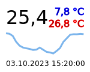
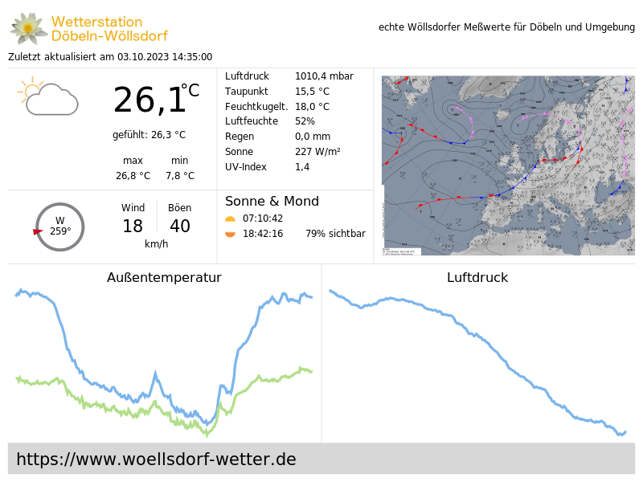
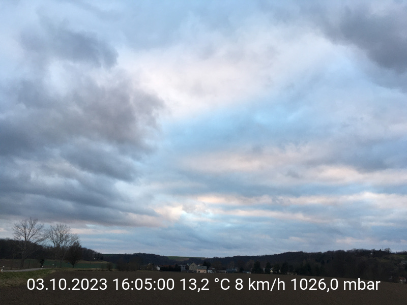

# weewx-svg2png
Convert SVG to PNG during skin creation

mini weather card | thumbnail | webcam image | forecast
------------------|-----------|--------------|----------
 |  |  | 

Using this generator you can
* create thumbnail images for the web pages created by WeeWX
* create weather cards
* put actual weather data onto webcam images

It is intended to create the SVG files by the CheetahGenerator
functionality of WeeWX.

## Prerequisites

First, install CairoSVG, if it is not already there.

```shell
sudo apt-get install cairosvg
```

This will install `python3-cairosvg` as well.

Alternatively you can install librsvg2-bin.

```shell
sudo apt-get install librsvg2-bin
```

## Installation instructions

1) download

   ```
   wget -O weewx-svg2png.zip https://github.com/roe-dl/weewx-svg2png/archive/master.zip
   ```

2) run the installer

   WeeWX up to version 4.X

   ```shell
   sudo wee_extension --install weewx-svg2png.zip
   ```

   WeeWX from version 5.0 on and WeeWX packet installation

   ```shell
   sudo weectl extension install weewx-svg2png.zip
   ```

   WeeWX from version 5.0 on and WeeWX pip installation into an virtual environment

   ```shell
   source ~/weewx-venv/bin/activate
   weectl extension install weewx-svg2png.zip
   ```
   
3) edit configuration in `skin.conf`

   See section "Configuration instructions"

5) restart weewx

   for SysVinit systems:

   ```shell
   sudo /etc/init.d/weewx stop
   sudo /etc/init.d/weewx start
   ```

   for systemd systems:

   ```shell
   sudo systemctl stop weewx
   sudo systemctl start weewx
   ```

## Configuration instructions
    
This is for use in skins. Add a reference to this generator to the
`generator_list` key in `skin.conf`:
    
```
[Generators]
    generator_list = ..., user.svg2png.SVGtoPNGGenerator
```
    
Then, add a section to `skin.conf` to configure the files to be
created as SVG and converted to PNG (replace `index_thumbnail` by
your file name and `file1` to something reasonable for you):
    
```
[CheetahGenerator]
    ...
    [[ToDate]]
        ...
        [[[file1]]]
            template = index_thumbnail.svg.tmpl
...
[SVGtoPNGGenerator]
    [[file1]]
        # file name without extension (optional)
        file = index_thumbnail
        # image width in pixels (optional)
        width = replace_me
        # image height in pixels (optional)
        height = replace_me
        # load external files (optional)
        unsafe = True
        # background color (optional, newer CairoSVG versions only)
        background_color = '#fff'
        # negate colors (optional, newer CairoSVG versions only)
        negate_colors = false
        # invert image (optional, newer CairoSVG versions only)
        invert_images = false
        # parent width and height (optional)
        parent_width = None
        parent_height = None
        # dpi setting (optional)
        dpi = 96
        # scale factor (optional)
        scale = 1
        # converter to use ('cairosvg' or 'rsvg2', optional)
        converter = cairo
    ...
```
    
If width and height are not provided, they will be taken out of the 
SVG file header.
    
If the `file` key is missing, the section name is used instead.

## Fonts

If you want to use special fonts within your SVG files you need to
inform the system about the existence of those fonts. This is done
by linking the font files or the directory containing the font files
to `/usr/local/share/fonts`. After that you have to update the
font cache.

Assuming your fonts reside in `/etc/weewx/skins/Belchertown/lib/fonts/`
you will enter:

```
cd /usr/local/share/fonts
sudo ln -s /etc/weewx/skins/Belchertown/lib/fonts belchertown-fonts
sudo fc-cache /usr/local/share/fonts
```

Please note, that this requires to download the fonts and store them
locally.

Now you can reference your fonts within the `<style>` section of your
SVG file template. Assuming your font is called `Roboto` (a font provided
by Google and used within the Belchertown skin) you would write:

```
    text {
        font-family: Roboto, sans-serif;
    }
```

## Usage

See the examples directory for example WeeWX templates to create an
SVG file.

[Examples](examples)

The examples include instructions how to
* have actual weather data on the created image
* include images from image files like webcam pictures or weather symbols
* create graphs of readings

Another example, this time involving DWD forecasts, you find in the
[weewx-DWD wiki](https://github.com/roe-dl/weewx-DWD/wiki/Kleines-Wetterbild).

### Thumbnail or preview image for social media references

In social media posts that reference web pages you often see a preview
image of the web page shown below the post. You may have wondered how 
this is done.

It is quite easy. You only need a thumbnail image as created by this
generator and a special `<meta>` statement within the header section
of your web page referencing it. Assuming your thumbnail is named
`index_thumbnail.png` and your domain is `example.com` this reads 
like this:

```
        <meta name="twitter:image" content="https://www.example.com/index_thumbnail.png?v=$current.dateTime.raw" />
        <meta property="og:image" content="https://www.example.com/index_thumbnail.png?v=$current.dateTime.raw" />
```

You can also specify wether the thumbnail is shown as a small image
besides the page description or as a large image above the page
description.

* for small thumbnails

  ```
        <meta name="twitter:card" content="summary" />
  ```

* for large thumbnails

  ```
        <meta name="twitter:card" content="summary_large_image" />
  ```

## Troubleshooting

* See the syslog for messages containing `user.svg2png`. They may
  reveal some reason for problems.
* To log the file names and paths set `debug = 1` in `weewx.conf` and
  restart WeeWX
* If you see a log message like this
  ```
  Oct 12 15:21:08 XXXX weewx[12345] ERROR user.svg2png: URLError <urlopen error [Errno 2] Datei oder Verzeichnis nicht gefunden: '/var/www/html/somepath/somefile.jpg'>
  ```
  then there is a file reference within one of your templates that could
  not be resolved. Check the template and fix the path.

  Enter
  ```
  ls -l /var/www/html/somepath/somefile.jpg
  ```
  to see whether the file exists.
* Relative paths are not the same as absolute paths. So for example
  `webcam/snap.jpg` (without slash) is not the same as `/webcam/snap.jpg`
  (with slash). Make sure you know the real location of your files.
* Check file names carefully. For example `snap.jpeg` (including 
  character e) is not the same as `snap.jpg` (without character e).
* If you experience erroneous results, you may want to try another
  converter. You can do so on a per file basis.

## References

* [WeeWX website](https://www.weewx.com)
* [WeeWX information in german](https://www.woellsdorf-wetter.de/software/weewx.html)
* [WeeWX customization guide](https://www.weewx.com/docs/customizing.htm)
  (See this guide for writing templates.)
* [Calculation in templates](https://web.archive.org/web/20230306134157/https://github.com/weewx/weewx/wiki/calculate-in-templates)
* [Tags for series](https://github.com/weewx/weewx/wiki/Tags-for-series)
* [CairoSVG website](https://cairosvg.org)
* [The Belchertown skin](https://github.com/poblabs/weewx-belchertown)
