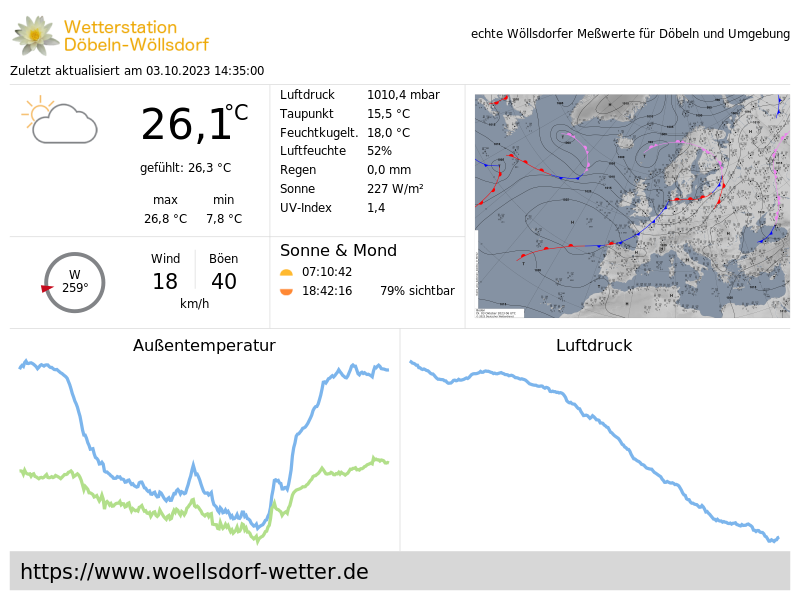
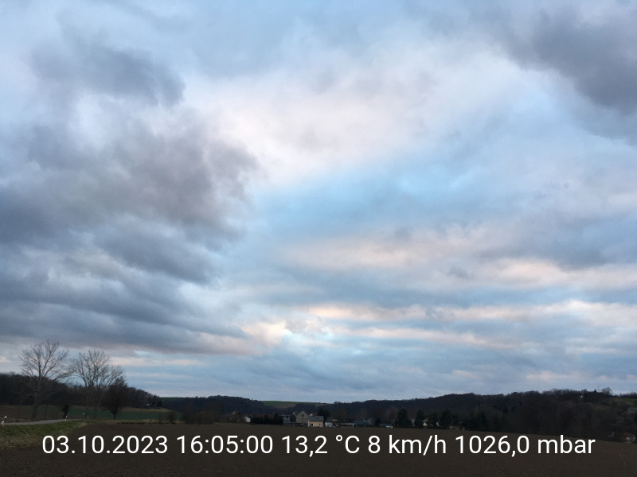

# Examples

The examples include the WeeWX template file for use in skins and the
resulting SVG and PNG files.

## Mini weather card

This is a very basic example to show how it works.

## Thumbnail

This is an advanced example creating a thumbnail image for the
Belchertown skin.

## Webcam image with weather data

This is another quite simple example how to put actual weather data
onto a webcam image.

